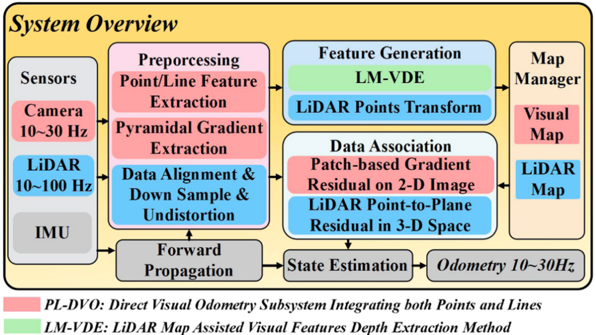
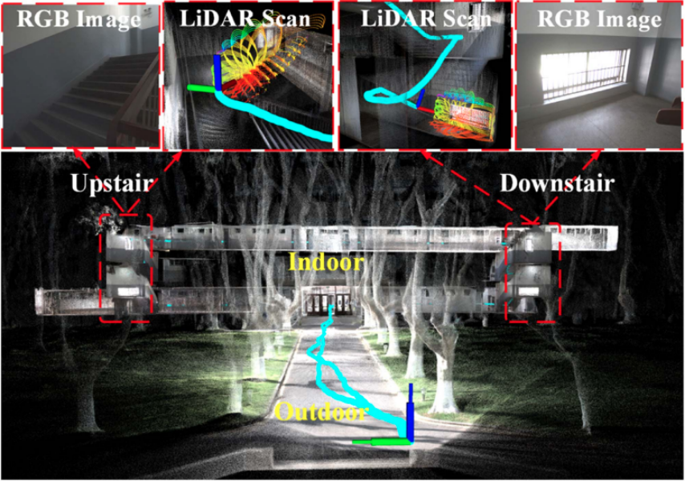
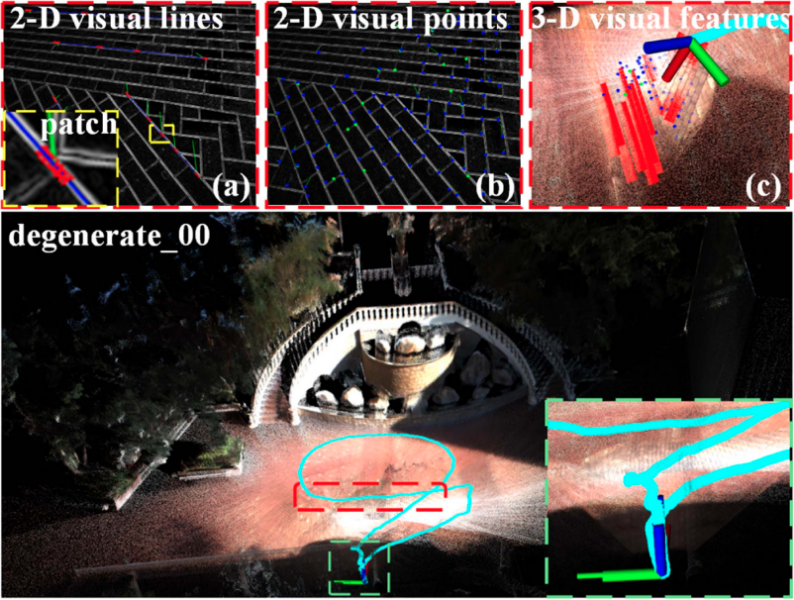

<p align="center">
  <h1 align="center">Point-line LIVO Using Patch-Based Gradient Optimization for Degenerate Scenes</h1>
  <p align="center">
  </p>
  <p align="center">
    <a href="https://ieeexplore.ieee.org/document/10688407">
      
    </a>
    <a href='https://s-torin.github.io/project-point-line-livo' style='padding-left: 0.5rem;'>
      
    </a>
    <a href='https://www.bilibili.com/video/BV1cAsYe7EUy/?spm_id_from=333.337.search-card.all.click&vd_source=a587155edf4c069832d58246dbeaa350' style='padding-left: 0.5rem;'>
      
    </a>
  </p>
</p>

Point-Line LIVO is a LiDAR-visual-inertial Odometry employing both visual Point and Line Patches on the Gradient image for robust localization in LiDAR-degenerate scenes.

<p align="center">
    
    
    
</p>

### 📢 News

<!-- - [2025-11-xx] Point-Line LIVO2 is unveiled! 🎉 [[`Paper`](#)] [[`Page`](#)] [[`bilibili`](#)] (to be released here) -->
- [2025-10-xx] Based on Point-Line LIVO, our Gaussian Splatting Mapping system (LIV-GSM) is unveiled! 🎉 [[`Paper`](#)] [[`Page`](https://s-torin.github.io/project-liv-gsm/)] [[`bilibili`](#)] (to be released here)
- [2025-9-28] The enhanced version of the Point-Line LIVO code is released!

### 💌 Contact

Questions? Please don't hesitate to reach out to Tong Shi at shitong_2001@163.com.

## Install

We test on ubuntu 20.04.

1. Install ROS Noetic.

2. Install Point-Line LIVO.

   ```shell
   mkdir -p ~/catkin_livo/src
   cd ~/catkin_livo/src
   git clone https://github.com/S-Torin/Point-line-LIVO.git
   cd ~/catkin_livo
   catkin_make
   ```

## Run

- Download [FAST-LIVO Dataset](https://connecthkuhk-my.sharepoint.com/:f:/g/personal/zhengcr_connect_hku_hk/Esiqlmaql0dPreuOhiHlXl4Bqu5RRRIViK1EyuR4h1_n4w?e=fZdVn0) or [R3LIVE Dataset](https://github.com/ziv-lin/r3live_dataset) or [FAST-LIVO2 Dataset](https://connecthkuhk-my.sharepoint.com/:f:/g/personal/zhengcr_connect_hku_hk/ErdFNQtjMxZOorYKDTtK4ugBkogXfq1OfDm90GECouuIQA?e=KngY9Z) or [SEU Dataset](https://github.com/S-Torin/).

+ Launch Point-Line LIVO.

  ```shell
  cd ~/catkin_livo
  source devel/setup.bash
  roslaunch livo fastlivo.launch
  # roslaunch livo r3live.launch
  # roslaunch livo fastlivo2.launch
  # roslaunch livo seu.launch
  ```

+ Play Rosbag.

  ```shell
  rosbag play YOUR_BAG
  ```


+ The localization and mapping results will be saved in  `~/catkin_livo/src/Point-line-LIVO/Log`.

## Citation

If you find our work helpful, please consider citing 🌟:

```bibtex
@ARTICLE{pl-livo,
  author={Shi, Tong and Qian, Kun and Fang, Yixin and Zhang, Yun and Yu, Hai},
  journal={IEEE Robotics and Automation Letters},
  title={Point-Line LIVO Using Patch-Based Gradient Optimization for Degenerate Scenes},
  year={2024},
  volume={9},
  number={11},
  pages={9717-9724},
  doi={10.1109/LRA.2024.3466088}
}
```

## Acknowledgement

Thanks for [FAST-LIO](https://github.com/hku-mars/FAST_LIO.git), [Voxel-Map](https://github.com/hku-mars/VoxelMap.git), [FAST-LIVO](https://github.com/hku-mars/FAST-LIVO.git), [FAST-LIVO2](https://github.com/hku-mars/FAST-LIVO2.git) and [LIV-GSM](https://s-torin.github.io/project-liv-gsm/).

## LICENSE

The code is released under the [GNU General Public License v3 (GPL-3)](https://www.gnu.org/licenses/gpl-3.0.txt).